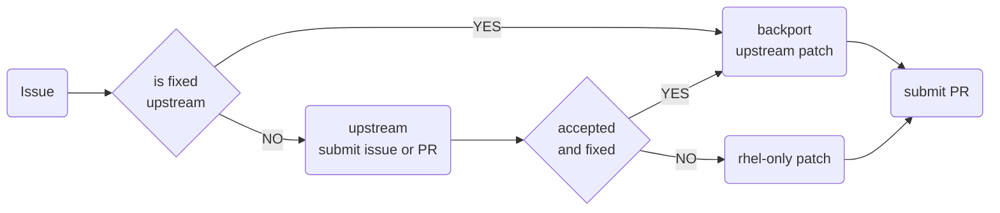

# Contributing

Welcome to systemd source-git for CentOS Stream and RHEL. When contributing please follow the guide bellow.

## Workflow



## Filing issues

When you find an issue with systemd used in CentOS Stream or RHEL please file an issue by using Bugzilla ticket systemd - [link](https://bugzilla.redhat.com/enter_bug.cgi?classification=Red%20Hat)
GitHub Issues are not supported tracking system. If your issus can be reproduced using latest upstream version of systemd, please consider creating [upstream issue](https://github.com/systemd/systemd/issues/new/choose).

## Posting Pull Requests

Every Pull Request has to comply with following rules in order to be merged and later included in release.

- Each commit has to reference [upstream](https://github.com/systemd/systemd) commit.
- Each commit has to reference approved issue/tracker.
- Pull request have to pass mandatory CI validation and testing
- Pull request have to be approved by at least one systemd downstream maintainer

### Upstream reference

When doing back-port of upstream commit always use `cherry-pick -x <sha>`. When upstream commit doesn't exist consider proposing change upstream first.
If change isn't upstream relevant or isn't accepted upstream mark commit with `rhel-only` string.

```md
doc: Fix TYPO

rhel-only

Resolves: #1234567
```

### Issue reference

Each commit has to reference relevant approved systemd issue (see: [Filling issues section](#filing-issues)). For referencing issues we use following keywords:

- **Resolves** for commits that directly resolves issues described in referenced tracker
- **Relates** for commits that are related to referenced issue but they doesn't fix the issue. Usually tests and documentation.
- **Reverts** for commits that reverts previously merged commit

```md
doc: Fix TYPO

(cherry picked from commit c5afbac31bb33e7b1f4d59b253425af991a630a4)

Resolves: #1234567
```

### Validation and testing

Each Pull Request has to pass all enabled tests that are automatically run using GitHub Actions, CentOS Stream CI and others.
If CI failure is unrelated to change introduced in Pull Request, downstream maintainer will set `ci-waived` label and provide reason why CI was waived.
